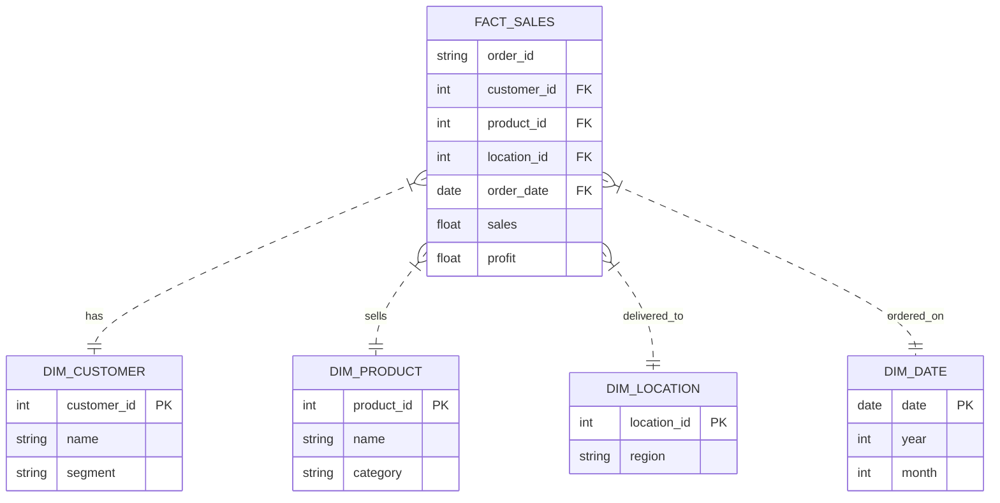

# Retail Analytics ETL

End-to-end ETL pipeline and analytics for the Global Superstore dataset. Built with Python (Pandas) and SQLite.

## Overview

Takes raw sales data from the [Superstore Dataset (Kaggle)](https://www.kaggle.com/datasets/vivek468/superstore-dataset-final), cleans it, builds a Star Schema (Facts/Dims), and loads it into a local SQLite DB for analysis.

**Stack:** Python, Pandas, SQLite, Parquet.

## Files

- `data/`: Raw csv and processed parquet/db files.
- `scripts/`:
    - `extract.py`: Loads the csv.
    - `transform_clean.py`: Fixes types, column names, etc.
    - `transform_model.py`: Builds the Star Schema.
    - `load.py`: Saves everything.
    - `main.py`: Runs the whole flow.
- `sql/`: Analysis queries.

## Data Model

Simple Star Schema:



## Running it

1.  **Install deps**:
    ```bash
    pip install pandas pyarrow fastparquet openpyxl
    ```

2.  **Run ETL**:
    ```bash
    python scripts/main.py
    ```
    Check `data/analytics/` for the output.

3.  **Analyze**:
    Run the queries in `sql/kpi_analysis.sql` against `data/analytics/retail_db.sqlite`.

## Analysis Results

**Regional Stats (Sales):**

| Market | Sales | Profit |
| :--- | :--- | :--- |
| APAC | $3.59M | $436k |
| EU | $2.94M | $373k |
| US | $2.30M | $286k |
| LATAM | $2.16M | $222k |
| EMEA | $806k | $44k |

**Top Regions:** Central ($2.8M), South ($1.6M), North ($1.2M).
