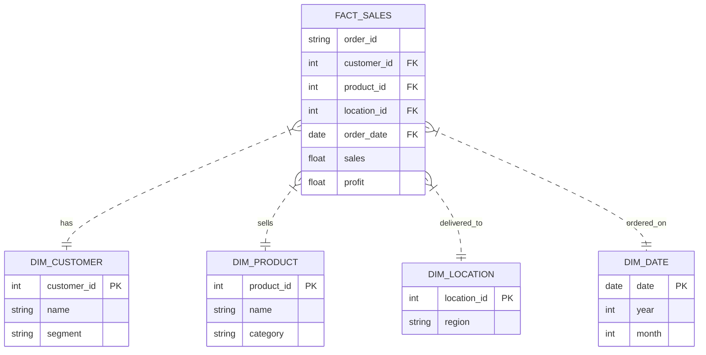

# Retail Analytics ETL

End-to-end ETL pipeline and analytics for the Global Superstore dataset. Built with Python (Pandas) and SQLite.

## Overview

Takes raw sales data, cleans it, builds a Star Schema (Facts/Dims), and loads it into a local SQLite DB for analysis.

**Stack:** Python, Pandas, SQLite, Parquet.

## Files

- `data/`: Raw csv and processed parquet/db files.
- `scripts/`:
    - `extract.py`: Loads the csv.
    - `transform_clean.py`: Fixes types, column names, etc.
    - `transform_model.py`: Builds the Star Schema.
    - `load.py`: Saves everything.
    - `main.py`: Runs the whole flow.
- `sql/`: Analysis queries.

## Data Model

Simple Star Schema:



## Running it

1.  **Install deps**:
    ```bash
    pip install pandas pyarrow fastparquet openpyxl
    ```

2.  **Run ETL**:
    ```bash
    python scripts/main.py
    ```
    Check `data/analytics/` for the output.

3.  **Analyze**:
    Run the queries in `sql/kpi_analysis.sql` against `data/analytics/retail_db.sqlite`.

## Analysis Results

**Regional Stats:**

| Region | Sales | Profit | Margin |
| :--- | :--- | :--- | :--- |
| West | $725k | $108k | 14.9% |
| East | $678k | $91k | 13.5% |
| South | $391k | $46k | 11.9% |
| Central | $501k | $39k | 7.9% |

**Top Customers:**
Sean Miller ($25k), Tamara Chand ($19k), Raymond Buch ($15k).
