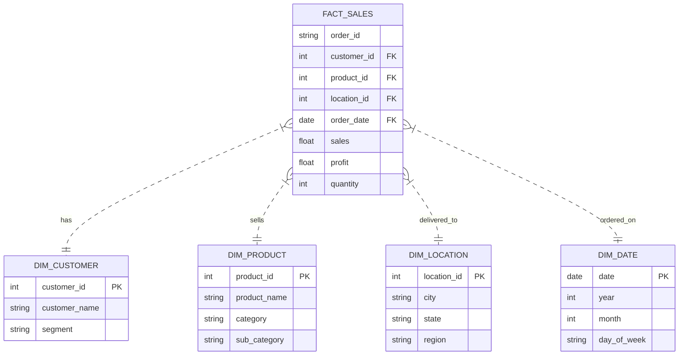

# Retail Analytics & ETL Automation Project

A complete end-to-end data engineering and analytics project using the Global Superstore dataset. This project demonstrates a full ETL pipeline, data modeling (Star Schema), and business intelligence capabilities.

## 📂 Project Structure
```
retail_analytics_etl/
├── data/
│   ├── raw/            # Original dataset
│   └── analytics/      # Processed Star Schema (CSV, Parquet, SQLite)
├── scripts/            # Python ETL Scripts
│   ├── extract.py      # Data ingestion
│   ├── transform*.py   # Cleaning & Modeling
│   └── load.py         # Data loading
├── sql/                # SQL Analysis
└── docs/               # Documentation
```

## 🚀 Tech Stack
- **Python**: Pandas, NumPy (Data Processing)
- **SQL**: SQLite (Data Warehousing & Analysis)
- **Data Formats**: CSV, Parquet
- **Architecture**: Star Schema (Fact/Dimension Modeling)

## 📊 Data Model
The project transforms raw flat-file data into a Star Schema optimized for analytics.



## 🛠️ How to Run
1. **Setup Environment**:
   ```bash
   pip install pandas pyarrow fastparquet openpyxl
   ```
2. **Run ETL Pipeline**:
   ```bash
   python scripts/main.py
   ```
   *This will process the raw data and generate the analytics-ready files in `data/analytics/`.*

3. **Run SQL Analysis**:
   Use any SQLite client to query `data/analytics/retail_db.sqlite` or run the provided queries in `sql/kpi_analysis.sql`.

## 📈 Dashboarding
Refer to [docs/dashboard_guide.md](docs/dashboard_guide.md) for instructions on building the Power BI/Tableau dashboard using the processed data.

## 💡 Key Insights & Analysis Results

### 1. Regional Performance
The **West** region is the top performer in both Sales and Profit.

| Region | Total Sales | Total Profit | Profit Margin % |
| :--- | :--- | :--- | :--- |
| West | $725,457 | $108,418 | 14.94% |
| East | $678,781 | $91,522 | 13.48% |
| South | $391,721 | $46,749 | 11.93% |
| Central | $501,239 | $39,706 | 7.92% |

### 2. Top Customers (RFM Analysis)
We identified high-value customers based on total spend (Monetary value).

| Customer Name | Segment | Total Spend | Frequency |
| :--- | :--- | :--- | :--- |
| Sean Miller | Home Office | $25,043 | 5 |
| Tamara Chand | Corporate | $19,052 | 5 |
| Raymond Buch | Consumer | $15,117 | 6 |
